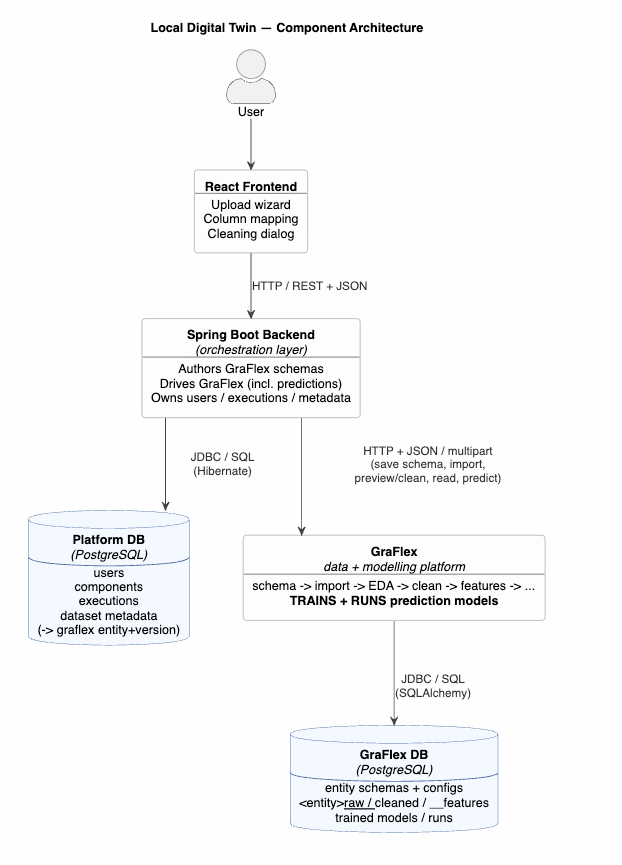

# Proposal: Integrating GraFlex for Data Upload & Cleaning

**Status:** Proposal for discussion
**Date:** 2026-09-26
**Audience:** Thesis supervisor, Lyudmil (GraFlex author)
**Author:** Radoslav

---

## 1. Purpose

This document proposes how the **orchestration platform** (Spring backend + React frontend)
and **GraFlex** (the standalone data platform) should work together for the first two stages
of the pipeline the user sees: **uploading a dataset** and **cleaning it**.

It is meant as a starting point for discussion. It states not just *what* to build, but
*why* each choice was made, so we can disagree on specifics without re-deriving the reasoning.

---

## 2. Background: what each system is

**The orchestration platform** is deliberately *not* an analysis tool. It is a
coordination layer: it ingests datasets, lets a user run **prediction models** against them, and
surfaces the results. It performs no data analysis or modelling itself — it drives the system
(GraFlex) that does.

**GraFlex** is a complete, self-contained data-and-modelling platform. It has its own PostgreSQL database and runs a full pipeline over tabular sensor data:

> schema definition → CSV import → EDA → cleaning → feature engineering → splitting → topology → **model training + prediction**

**The prediction models live inside GraFlex.** GraFlex both prepares the data *and* trains and runs
the models that produce the three prediction kinds the thesis targets — prediction in **time**
(future values at an existing station), in **space** (values at a new location), and in **space +
time**. This makes GraFlex the analytical core, not merely a data-prep service.

GraFlex already runs **standalone** (driven from a notebook today, against its own database),
which matches the requirement that the Python data component work independently of
the Spring/React apps.

**Key consequence:** GraFlex is far more than the current `data-analysis-service` (a small Pandas
stub that only inspects CSV structure and extracts stations). The plan below assumes GraFlex will
**supersede** `data-analysis-service` — see §8.

---

## 3. The core architectural principle

> **The platform authors the schema and owns the user experience.
> GraFlex owns data storage, data processing, and the prediction models.
> The two communicate over HTTP only — the platform never touches GraFlex's database directly.**

Everything below follows from this principle. The reason for the HTTP-only boundary is explained
in §7.

---

## 4. Architecture at a glance



### Components and why each exists

| Component | Why it is there                                                                                                                                                                                                                                                                                                                                                                                                                                        |
|---|--------------------------------------------------------------------------------------------------------------------------------------------------------------------------------------------------------------------------------------------------------------------------------------------------------------------------------------------------------------------------------------------------------------------------------------------------------|
| **React Frontend** | The only thing the user touches. Owns the upload wizard, the column-role mapping UI, and the cleaning dialog. Holds *no* analytical or storage logic — it just calls the backend.                                                                                                                                                                                                                                                                      |
| **Spring Boot Backend** | The **orchestration layer**. It coordinates everything but analyses nothing itself: it authors GraFlex schemas from the user's column mapping, drives GraFlex over HTTP (including asking it to run a prediction), and records what happened.                                                                                                                                                                                                          |
| **Platform DB** (PostgreSQL) | The backend's own store: users (later), registered components, execution records, and **dataset metadata** — including a pointer to the corresponding GraFlex entity + version. It does **not** hold the dataset rows themselves.                                                                                                                                                                                                                      |
| **GraFlex** | The **data platform *and* the model host** — does the actual data work (import, cleaning, features) **and trains + runs the prediction models** (the graph and baseline forecasters that produce the temporal / spatial / spatio-temporal predictions). It is a separate, self-contained system that already runs standalone against its own database, satisfying the requirement that the data component work independently of the Spring/React apps. |
| **GraFlex DB** (PostgreSQL) | GraFlex's own store: entity schemas, saved configs (cleaning recipes, etc.), the actual dataset rows in per-entity `raw` / `cleaned` / `features` tables, and the trained-model / run records. Only GraFlex connects to it.                                                                                                                                                                                                                            | |

---

## 5. Proposed flow — Data Upload

The user uploads one or more station CSV files and tells the platform what each column means; the
platform turns that into a GraFlex **entity schema** and imports the rows into GraFlex.

### Step 1 — Upload CSV file(s) in the UI
The user selects one or more CSV files. (Already implemented.)

### Step 2 — The browser reads the headers and pre-guesses each column's role
This happens **entirely in the browser** — no server call. The frontend already reads the CSV
header line and guesses a role for each column (e.g. a column named `lat` is guessed as latitude).

> **Why client-side, not via GraFlex?** This already works today and needs no network round-trip.
> GraFlex's job begins when we save a schema, not when we read a header line. Sending files to
> GraFlex just to list their columns would add complexity for no benefit.

### Step 3 — The user confirms column roles and (optionally) data quality hints
For each column the user assigns a **role**:

| Platform role | Meaning |
|---|---|
| `STATION_ID` | The station/point identifier |
| `LATITUDE` / `LONGITUDE` | The station's location |
| `TIMESTAMP` | The time axis of a reading |
| `MEASUREMENT` | A measured quantity (PM2.5, NO₂, …) |
| `STATION_ATTRIBUTE` | Descriptive station info (name, type, …) |
| `IGNORE` | Not imported |

The user may **optionally** also set, per measurement column:
- its **data type** (defaulted sensibly — measurements→number, timestamp→timestamp, ids→text),
- a **valid range** (e.g. PM2.5 ∈ [0, 500]),
- **missing-value sentinels** (e.g. `-999` means "no reading", common in sensor exports).

> **Why optional?** Requiring a valid range and sentinels for every column would make uploading
> tedious. These are *data-quality hints* that the cleaning stage later uses; sensible defaults
> (no range, no sentinels) let a user upload quickly, while power users can be precise.
>
> **Why capture sentinels at all?** Many sensor feeds encode "missing" as an out-of-band number
> like `-999` rather than an empty cell. If we don't declare that, downstream cleaning and models
> treat `-999` as a real reading and corrupt every average. GraFlex's cleaning can convert declared
> sentinels to true nulls — but only if we tell it which values are sentinels.

### Step 4 — The platform builds **two** GraFlex schemas
A single upload becomes **two** GraFlex entity schemas, because GraFlex (sensibly) separates a
station's *fixed location* from its *time-varying readings*:

1. a **static station schema** — the station id, its latitude/longitude, and any attributes;
2. a **timeseries measurement schema** — the station id, the timestamp, and the measured values,
   linked back to the station schema by the station id (a foreign-key reference).

> **Why two schemas?** This mirrors how GraFlex models the world (a static "station" entity and a
> timeseries "measurements" entity, joined by the station id) and how our own platform already
> stores data (stations separate from measurements). Splitting them keeps each row lean —
> coordinates are not repeated on every reading — and matches GraFlex's example schemas exactly.

### Step 5 — One **atomic** call to GraFlex: create the dataset (schema + import together)
The platform sends the schema(s) **and** the CSV to a **single** GraFlex endpoint, which saves the
schema(s) and imports the rows **inside one database transaction**: either both land, or neither
does (with an error report). No half-created dataset is possible.

> **Success policy (to confirm with Lyudmil).** Import has two failure shades:
> - **Structural refusal** — the file does not match the schema (a required column is missing).
>   Nothing usable landed → **roll back the whole transaction** (schema included) and return the
>   refusal report.
> - **Row-level coercion errors** — most rows are fine, a few cells fail to parse to their declared
>   type. Recommended: **commit the good rows, report the bad ones** (do *not* roll back) — the very
>   next stage is *cleaning*, whose job is to resolve bad data; a few uncoercible rows should not
>   reject a whole upload. See §10 for this open question.
>
> Either way the platform shows the **import report** (rows read/written, violations, refusal
> reason) in the UI, and only records its own dataset metadata when the call succeeds.

> **One ingestion endpoint only.** The contract exposes *no* standalone "save a schema" or "import
> into an existing entity" — the atomic create-dataset call is the single way data enters. This keeps
> the API minimal and makes an orphaned schema structurally impossible. Appending more data to an
> existing dataset is a **deferred** question (the MVP treats one upload as one dataset) — see §10.

---

## 6. Proposed flow — Data Cleaning

A dedicated **Cleaning** area lets the user turn raw imported data into a cleaned version.

### Step 1 — A Cleaning tab/section
Operates on the dataset's *raw* version and produces a *cleaned* version. GraFlex keeps these as
separate stored versions (raw, cleaned, features) — cleaning never destroys the original.

### Step 2 — The user picks cleaning steps and their settings in a dialog
GraFlex offers a set of cleaning steps — e.g. *replace missing-value sentinels with null*, *fill
missing values* (median / forward-fill / constant), *enforce valid ranges* (clip / null / drop),
*drop duplicate rows*, *handle outliers*, and more. Each step has its own settings.

> **Recommendation:** GraFlex should expose a "list of available cleaning steps and their settings"
> so the dialog can be **built dynamically** from what GraFlex actually supports, rather than the
> frontend hardcoding each step's form.

### Step 3 — Preview before committing
Before writing anything, the user sees a **preview**: how many rows/columns each step changes.

> **Why preview?** Cleaning is destructive-looking to a user ("will this delete my data?").
> GraFlex can run the steps *without writing*, so the user sees the effect first. This turns
> cleaning from "run and hope" into an informed choice.

### Step 4 — Commit: GraFlex writes the cleaned version; the cleaning recipe is saved
On commit, GraFlex applies the steps, writes the cleaned version, and **saves the cleaning recipe**
(the ordered list of steps) as a reusable, versioned config.

> **Why save the recipe, not just the result?** Cleaning is iterative — a user will tweak steps and
> re-run. GraFlex versions the cleaned output each time the recipe changes, so we can compare and
> reproduce. Treating cleaning as a *saved, editable recipe* (not a one-off action) matches how
> GraFlex already works.

### Step 5 (recommended) — A lightweight data-quality view to guide cleaning
Before cleaning, show a small summary of *what is wrong* with the data: how many values hit a
missing-sentinel, how many are out of range, time gaps, stuck sensors, etc. GraFlex produces
exactly this (its read-only "exploratory analysis" stage).

> **Why include it?** A user can only choose the *right* cleaning steps if they can *see* the
> problems. Without this, the cleaning dialog asks the user to fix issues they cannot observe.
> A full analysis UI is not needed for a first version, but even a simple "per-column summary +
> problem counts" makes the cleaning step usable — and demonstrates that the platform *understands*
> the data, which is a good thesis talking point.

---

## 7. Why the platform talks to GraFlex over HTTP, never its database directly

Both the platform and GraFlex use PostgreSQL. It is tempting to let the platform read GraFlex's
tables directly. We propose **not** to, and instead go through GraFlex's HTTP API.

**Reasons:**
- **GraFlex's data tables are created dynamically**, named after each entity/version (e.g.
  `station_measurements__cleaned`). If the platform queried them directly, it would be tied to
  GraFlex's internal naming — and any refactor Lyudmil makes to that layout would silently break
  the platform.
- **Clean ownership.** GraFlex owns its schema and storage; the platform owns its own (users,
  components, executions, dataset metadata). An HTTP boundary keeps these from entangling.
- **It matches how the platform already works** — the backend already calls the existing Python
  service over HTTP, and the "backend never does data processing itself" rule is already in place.

**Resulting two-database picture:**

| Database | Owner | Who connects |
|---|---|---|
| Platform DB | Spring / Hibernate | **Platform only** — users, components, executions, dataset *metadata* |
| GraFlex DB | GraFlex | **GraFlex only** — schemas, configs, raw/cleaned/feature tables |

The platform reaches dataset *data* by asking GraFlex over HTTP, not by opening a SQL connection to
GraFlex's database.

### Where execution results are stored (a consequence of this boundary)

Running a prediction produces two related-but-different things, which have different owners:

1. **The execution record** — *"user X ran model Y against dataset Z at time T; status; the
   measurement mapping used."* This is **orchestration provenance** and lives in the **Platform DB**.
   GraFlex structurally cannot hold it: GraFlex has no concept of the platform's users, its
   registered components, or its dataset ids — and, crucially, **some executions never reach
   GraFlex at all** (an invalid mapping rejected with `400`, or GraFlex being unreachable). Those
   still need an execution row; only the platform can provide it.
2. **The prediction output + the reproducible run** — the predicted values, plus the config / metrics
   / trained model that produced them. GraFlex **owns this** (it is the system that computed it, and
   its own pipeline needs the run record for reproducibility and re-analysis).

**How they link — reference, don't duplicate.** GraFlex keeps a `run_id → result` mapping in its own
store. The Platform DB's `executions` table carries a **`graflex_run_id`** column that references
that run. This is a **logical reference resolved over HTTP** (e.g. `GET /runs/{run_id}`), **not** a
SQL foreign key — the two databases cannot join, and nothing enforces integrity across them.

Two rules make this correct:

- **`graflex_run_id` is nullable.** It is populated when GraFlex actually ran, and null for
  executions that failed before reaching GraFlex. (This is the second reason the execution record
  must live in the platform.)
- **The platform also caches the result on the execution, for display.** The `graflex_run_id`
  pointer is the source-of-truth link (for audit / regenerate); a **cached copy** of the result on
  the execution row is what the UI shows — so displaying a past execution does not depend on GraFlex
  being up, and does not re-query GraFlex on every view. The cached result is safe to keep because a
  completed prediction is **immutable** (the same immutable-snapshot caching the platform already
  uses for fetched-dataset analysis). If GraFlex produces a new run, that is a **new execution** —
  the old cached result is never mutated in place.

Resulting `executions` shape (platform side):

```
id                (platform UUID — the platform's own execution id)
user_id, component_id, dataset_id, measurement_mapping
status, created_at, finished_at, error_message
graflex_run_id    (nullable — reference to GraFlex's run; null if it never reached GraFlex)
result            (nullable — cached copy of GraFlex's output, for display)
```

> **Open question for GraFlex (see §10):** for a *prediction* call, what stable id does GraFlex
> return — a per-prediction `run_id`, or just the underlying trained-model/run id? GraFlex already
> persists *training* runs; whether an inference call is also persisted-and-addressable determines
> exactly what `graflex_run_id` points at (and, if prediction is stateless, the platform's cached
> `result` becomes the only stored copy of that specific prediction — which is acceptable).

---

## 8. Relationship to the current `data-analysis-service`

The plan assumes GraFlex **supersedes** the current `data-analysis-service`. Recommended sequencing:

1. GraFlex grows the HTTP API this plan needs (see §9). `data-analysis-service` keeps working
   throughout.
2. The new upload + clean flow is pointed at GraFlex, while the old path still functions.
3. Once GraFlex fully covers ingestion and cleaning, `data-analysis-service` is removed.

> **Why not replace it immediately?** GraFlex has **no HTTP API yet** (it is notebook-driven
> today). Removing the working service before its replacement exists would leave the platform
> non-functional. "Supersede then delete" keeps the platform working at every step.

---

## 9. What this requires from GraFlex (the HTTP API to build)

GraFlex currently has no HTTP layer. This plan needs the following endpoints, each a thin wrapper
over a GraFlex function that **already exists** (named in the "GraFlex function" column). This
section is the **contract** between the two workstreams: once agreed, Lyudmil can build the
endpoints while the platform side builds the UI and translation logic in parallel.

| # | Endpoint | GraFlex function | Used by |
|---|---|---|---|
| 1 | `POST /datasets` *(atomic: schema(s) + import in one transaction)* | *(new — wraps `save_entity_schema` + `import_csv_text` in one DB transaction)* | **Upload** |
| 2 | `GET /cleaning-steps` | *(new — enumerate registered steps + param schema)* | Cleaning step 2 |
| 3 | `POST /entities/{entity}/clean/preview` | `preview_clean` | Cleaning step 3 |
| 4 | `POST /entities/{entity}/clean` | `save_cleaning_config` + `clean` | Cleaning step 4 |
| 5 | `GET /entities/{entity}/versions` | `list_versions` | Show data in UI |
| 6 | `GET /entities/{entity}/versions/{version}` | `read_version` | Show data in UI |
| 7 | `POST /entities/{entity}/eda` *(optional)* | `run_eda` | Quality view (cleaning step 5) |

> Two endpoints are genuinely **new** work: the atomic `POST /datasets` (#1) needs a thin
> transactional wrapper around GraFlex's existing `save_entity_schema` + `import_csv_text` so the
> two commit or roll back together (see §5 step 5); and `GET /cleaning-steps` (#2) enumerates the
> registered cleaning steps. Everything else wraps a function that already exists.
>
> **Ingestion is deliberately a single endpoint.** There is no standalone "save a schema" or
> "import into an existing entity" in the contract: the MVP treats one upload as one dataset, so the
> atomic `POST /datasets` is the only way data enters. This keeps the API minimal and makes an
> orphaned schema *structurally impossible* — there is no way to create a schema without data. (The
> underlying `save_entity_schema` / `import_csv_text` functions still exist inside GraFlex; they are
> just not exposed separately. Appending data to an existing dataset is a deferred question — see §10.)


> The shapes below are illustrative and follow GraFlex's existing data models
> (`EntitySchema`, `CleaningConfig`, `ImportReport`, …). Field names/exact structure are for
> discussion — the point is to make the contract concrete, not final.

### 9.1 `POST /datasets` — atomic create (schema(s) + import) — **the ingestion endpoint**

The single call by which data enters the platform. Sends the schema(s) and the CSV together;
GraFlex saves the schema(s) and imports the rows **in one transaction** (all-or-nothing — no
orphaned schema possible).

**Request** — `multipart/form-data`: the CSV file(s) + a JSON part carrying the schema(s) and the
column mapping:
```json
{
  "schemas": [
    {
      "id": "sofia_station",
      "temporality": "static",
      "keys": { "primary": ["point_id"] },
      "columns": [
        { "name": "point_id",  "type": "string",  "role": "entity_id", "nullable": false },
        { "name": "name",      "type": "string",  "role": "metadata" },
        { "name": "latitude",  "type": "float64", "role": "spatial",   "nullable": false },
        { "name": "longitude", "type": "float64", "role": "spatial",   "nullable": false }
      ]
    },
    {
      "id": "sofia_air_quality",
      "temporality": "timeseries",
      "keys": { "primary": ["point_id", "timestamp"] },
      "columns": [
        { "name": "point_id",  "type": "string",    "role": "entity_id",  "nullable": false,
          "references": "sofia_station.point_id" },
        { "name": "timestamp", "type": "timestamp", "role": "event_time", "nullable": false },
        { "name": "pm2_5",     "type": "float64",   "role": "measure", "unit": "ug/m3",
          "valid_range": [0, 500], "missing_sentinels": [-999] },
        { "name": "no2",       "type": "float64",   "role": "measure", "unit": "ug/m3",
          "valid_range": [0, 1000] }
      ]
    }
  ],
  "primary_entity": "sofia_air_quality",
  "column_mapping": { "station": "point_id", "lat": "latitude", "ts": "timestamp", "pm25": "pm2_5" }
}
```

The two schemas capture GraFlex's static-station / timeseries-measurement split (§5 step 4). Roles
are GraFlex's five semantic roles (`entity_id`, `event_time`, `spatial`, `measure`, `metadata`); the
platform maps its upload roles onto these (§5 step 4). `valid_range`, `missing_sentinels`, and
`domain` are the optional data-quality hints from §5 step 3.

**Response** `200 OK` — an **import report** (GraFlex's `ImportReport`), plus the created
entity/version:
```json
{
  "entity": "sofia_air_quality",
  "version": 1,
  "source": "sofia-air-quality.csv",
  "refused": false,
  "missing_required_columns": [],
  "rows_read": 8760,
  "rows_written": 8742,
  "row_errors": [
    { "row": 412, "column": "timestamp", "message": "could not parse '2026-13-01' as timestamp" }
  ],
  "violations": [
    { "column": "pm2_5", "null_count": 30, "sentinel_count": 18, "out_of_range_count": 2,
      "unknown_domain_count": 0 }
  ]
}
```

**On a structural refusal** (a required column is missing) the whole transaction is rolled back — the
schema is *not* saved — and the response is `refused: true` with `missing_required_columns`:
```json
{ "refused": true, "missing_required_columns": ["timestamp"], "rows_read": 0, "rows_written": 0 }
```

> A refusal is **not an error** — it is a `200` with `refused: true`, an expected user-facing outcome
> the UI surfaces. **Row-level coercion errors** (a few cells that don't parse) are handled per the
> success policy in §5 step 5 (recommended: commit the good rows, report the bad ones) — see the open
> question in §10.

### 9.2 `GET /cleaning-steps` — enumerate available cleaning steps

The one genuinely **new** thing GraFlex must expose (the rest wrap existing functions). Lets the
cleaning dialog build itself from what GraFlex supports.

**Response** `200 OK`:
```json
{
  "steps": [
    { "type": "replace_sentinels_with_null", "description": "Turn declared missing sentinels into nulls.",
      "params": [] },
    { "type": "fill_missing", "description": "Fill a column's nulls.",
      "params": [
        { "name": "column", "type": "string", "required": true },
        { "name": "method", "type": "enum", "options": ["median", "forward", "constant"], "required": true },
        { "name": "value",  "type": "number", "required": false }
      ] },
    { "type": "enforce_valid_range", "description": "Resolve values outside a column's valid_range.",
      "params": [ { "name": "action", "type": "enum", "options": ["clip", "null", "drop"], "required": true } ] }
  ]
}
```

### 9.3 `POST /entities/{entity}/clean/preview` — preview without writing

**Request** — a cleaning recipe (GraFlex's `CleaningConfig`: an ordered list of steps):
```json
{
  "steps": [
    { "type": "replace_sentinels_with_null" },
    { "type": "fill_missing", "config": { "column": "pm2_5", "method": "median" } },
    { "type": "enforce_valid_range", "config": { "action": "clip" } }
  ]
}
```

**Response** `200 OK` — per-step before/after (from GraFlex's `PipelineRun`), nothing written:
```json
{
  "steps": [
    { "type": "replace_sentinels_with_null", "rows_in": 8742, "rows_out": 8742, "cells_changed": 18 },
    { "type": "fill_missing",                "rows_in": 8742, "rows_out": 8742, "cells_changed": 48 },
    { "type": "enforce_valid_range",         "rows_in": 8742, "rows_out": 8742, "cells_changed": 2 }
  ]
}
```

### 9.4 `POST /entities/{entity}/clean` — commit a cleaning recipe

**Request** — same recipe as preview, plus a `name` to save it under:
```json
{
  "name": "sofia_aq/basic",
  "steps": [
    { "type": "replace_sentinels_with_null" },
    { "type": "fill_missing", "config": { "column": "pm2_5", "method": "median" } }
  ]
}
```

**Response** `200 OK` — the cleaning ran, `<entity>__cleaned` was written, the recipe saved:
```json
{
  "entity": "sofia_air_quality",
  "config_name": "sofia_aq/basic",
  "config_version": 1,
  "target_version": "cleaned",
  "rows_written": 8742
}
```

### 9.5 / 9.6 — list and read stored versions

`GET /entities/{entity}/versions` →
```json
{ "versions": [ { "version": "raw", "rows": 8742 }, { "version": "cleaned", "rows": 8742 } ] }
```

`GET /entities/{entity}/versions/{version}?limit=100` → a page of rows (JSON records) for display.

### 9.7 `POST /entities/{entity}/eda` *(optional)* — data-quality report

**Request** — a list of analysis steps (GraFlex's `EdaConfig`):
```json
{ "steps": [ { "type": "overview" }, { "type": "schema_violations" }, { "type": "missingness" } ] }
```

**Response** — a read-only report (never persisted) the quality view renders. Shape mirrors
GraFlex's `EdaReport` sections.

### Cross-cutting notes for the contract

- **`project_id`**: GraFlex scopes everything by a project (default `"default"`). For the MVP the
  platform can pass the implicit default; multi-project is out of scope.
- **Errors**: `400` for a bad schema / bad step config (GraFlex validates before touching data);
  `404` for an unknown entity/version. An import *refusal* is **not** an error — it is a `200`
  with `refused: true`, because it is an expected, user-facing outcome.
- **Transport**: same posture as the existing Python service — plain HTTP/1.1, multipart for the
  ingestion endpoint (`POST /datasets`, which carries the CSV file); everything else is JSON.

---

## 10. Open questions to resolve together

1. **Which GraFlex ingestion path does the upload feed?** GraFlex has both a *generic* per-schema
   import (flexible column shapes) and a *fixed* "collection" table set (hardcoded columns for the
   Sofia air-quality dataset). This plan assumes the **generic** path. We should confirm which one
   the upload should target — it changes step 4/5.
2. **Who authors the schema — interactively at upload, or from a stored template?** This plan
   proposes interactive authoring at upload time.
3. **How much of GraFlex's later pipeline** (features, splitting, topology, training) do we expose
   to the user for the thesis MVP, versus running with sensible defaults behind the scenes?
4. **Endpoint ownership & timeline** — agreeing the §9 list and who builds what, when.
5. **What id does a prediction return?** GraFlex persists *training* runs today; does a *prediction*
   call also get a stable, addressable `run_id` (per-prediction), or does it only expose the
   underlying trained-model/run id? This determines what the platform's `graflex_run_id` references
   (see §7). If prediction is stateless, the platform's cached result is the only stored copy of that
   specific prediction — acceptable, but should be a conscious decision.
6. **Partial-import success policy.** The atomic `POST /datasets` (§9.1) rolls back on a *structural
   refusal* (a required column is missing). But when *some rows* fail type coercion while most are
   fine, do we **commit the good rows and report the bad ones** (recommended — cleaning handles the
   rest), or **roll back the whole upload** on any row error, or apply a **threshold** (commit if the
   error rate is below X%)? This is a policy choice for the atomic endpoint, to agree with Lyudmil.
7. **Can a dataset accumulate data from multiple uploads?** The MVP treats one upload as one dataset,
   so the contract exposes only the atomic `POST /datasets`. If a dataset should instead grow over
   time (e.g. upload January, then February, into the same entity), a standalone "import into an
   existing entity" endpoint is needed — deferred, and purely additive if it turns out to be wanted.

---

## 11. Summary

- The platform owns the **upload/mapping/cleaning UX** and **authors GraFlex schemas**; GraFlex owns
  **storage, processing, and the prediction models**; they talk **over HTTP only**.
- Upload = read headers in the browser → map roles (+ optional quality hints) → build **two** schemas
  → **one atomic call** that saves the schema(s) and imports the data in a single transaction (no
  orphaned schema possible), returning a clear import report.
- Cleaning = a dedicated tab → pick steps in a dialog (ideally driven by GraFlex's step catalog) →
  **preview** → **commit** (which also saves a reusable, versioned recipe), guided by a lightweight
  **data-quality view**.
- GraFlex **supersedes** `data-analysis-service`, but only **after** its HTTP API exists — the old
  service stays until then.
